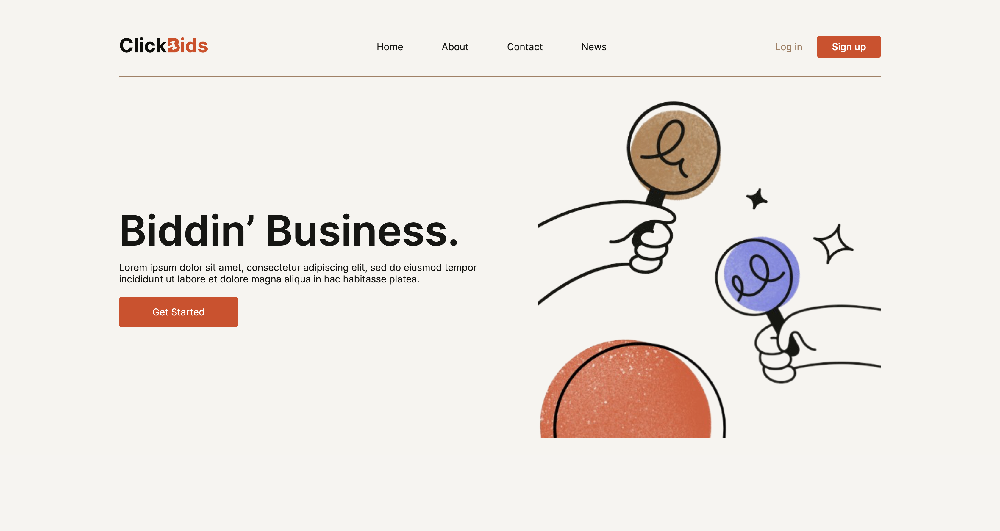
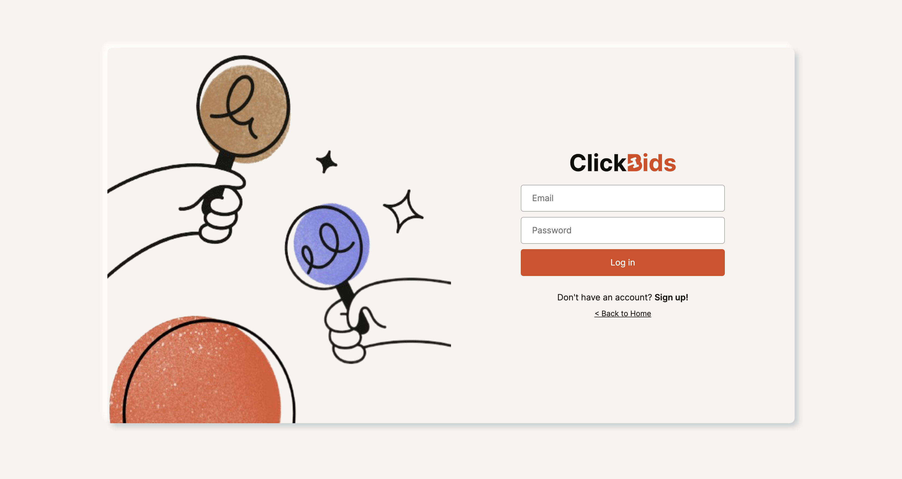
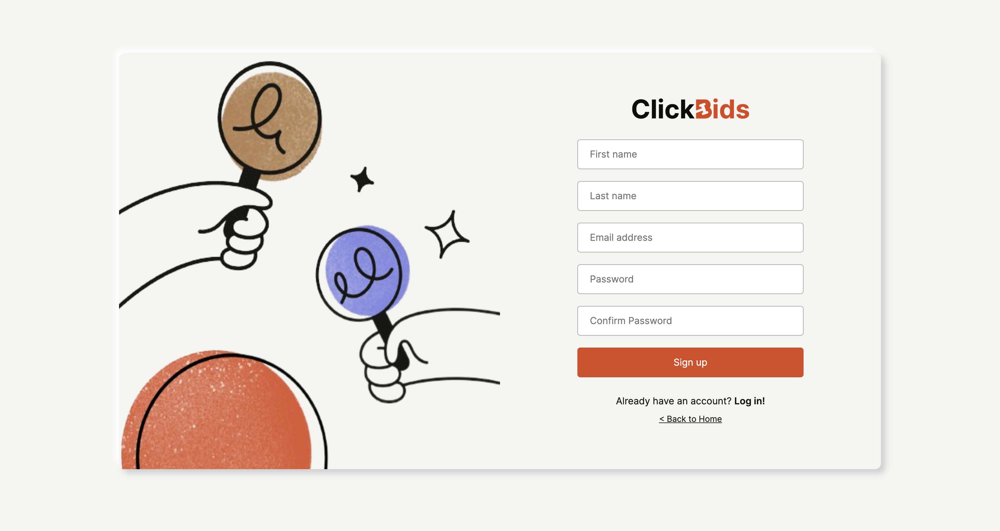
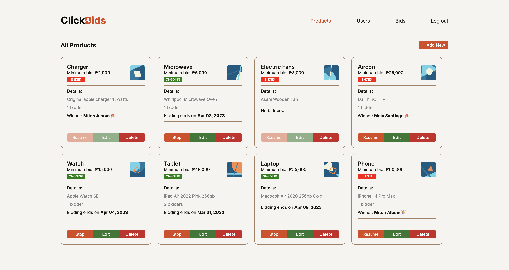
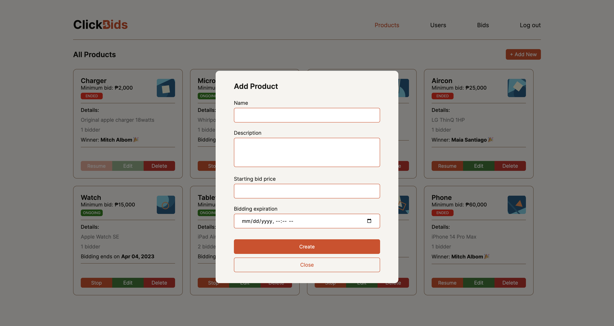
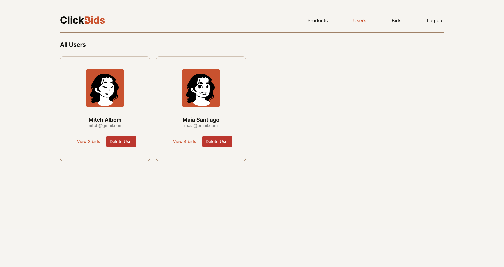
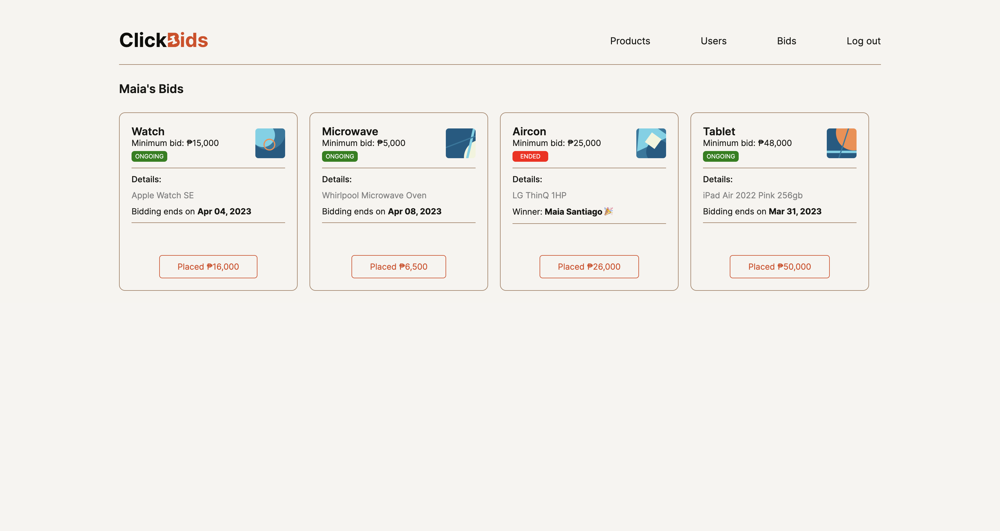
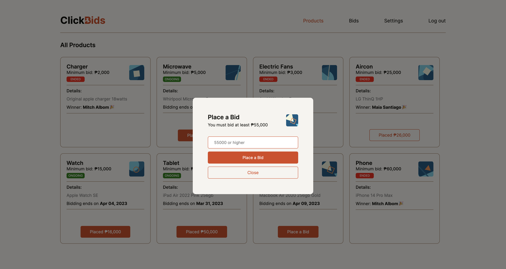
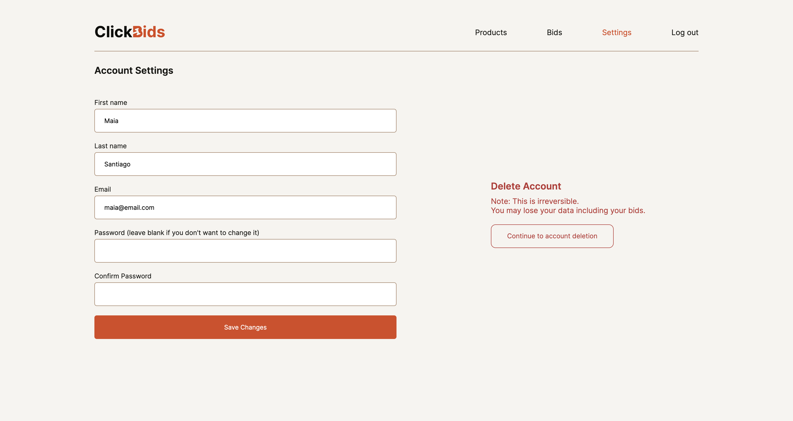

### ✨ [Bidding App (Click to see live version)](https://bidding-app.onrender.com/)

>> ###### *A Ruby on Rails application allowing users to place a bid.*
>> - Utilized scaffold to auto generate a set of model, views, and controller for user, product, and bid table and create a full CRUD web interface.
>> - Installed Bcrypt Ruby gem so users can log in and sign up using email and password.
>> - Implemented model and system tests to simulate user interaction.
>> - Allowed admin to add, edit, delete, stop, and resume a product for bidding.
>> - Enabled bidders to place and update their bids.
>> - Added modals using turbo frames.
>> - Displayed user avatars and products shapes by utilizing DiceBear avatar library.
>> - Showed flash messages using turbo.

>> ##### **Sign in as admin:**
>> - Email address: admin@email.com
>> - Password: admin123

>> ###### Sources:
>> - Images from [canva](https://www.canva.com) and [linkpicture](https://www.linkpicture.com).
>> - Design inspired by [flatstudio project](https://flatstudio.co/projects/clickbids).
>> - [Rails](https://drive.google.com/file/d/1lx8bkaXAfSo9rv20O_ZOpeFmEZkgmjyc/view), [Turbo Drive](https://www.hotrails.dev/turbo-rails/turbo-drive) handbook.
>> - [DiceBear Avatar Library](https://avatars.dicebear.com/).